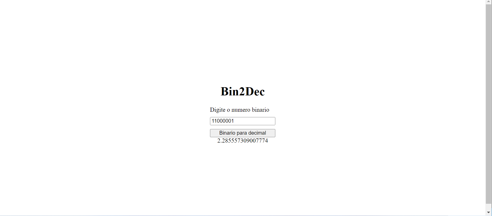
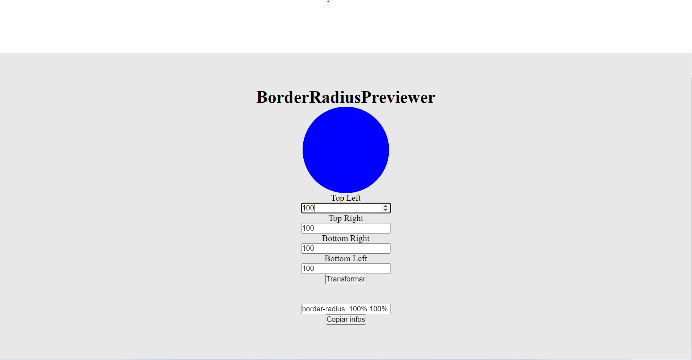

# App Ideias

# Sobre o projeto

App-Ideia é uma lista de projetos, no qual me desafiei a completar.

Aqui está a lista completa de projetos: https://github.com/florinpop17/app-ideas.

Todo projeto completo será marcado com um * no começo da linha com a imagem da resolusão caso tenha front.

| Name                      | Short Description                                       |
| ------------------------- | ------------------------------------------------------- |
| * Bin2Dec                 | Binary-to-Decimal number converter                      |
| * Border Radius Previewer | Preview how CSS3 border-radius values affect an element |

# Autor

Rafael Corrêa Nunes

https://www.linkedin.com/in/rafael-correa98/
